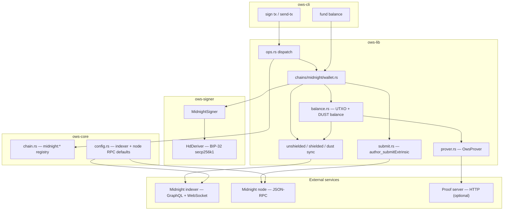

# Midnight OWS Integration — Architecture

> Status: implemented in this fork (Preview / Preprod / mainnet). This document describes how
> Midnight is wired into OWS end-to-end: crates, cryptography, external services, dependencies,
> and how it differs from other chain families.

## Overview

Midnight is a privacy-oriented ledger with **three parallel credential lanes** (unshielded Night,
shielded Zswap, and DUST). OWS still exposes Midnight as a single entry in the universal wallet
(one row per family in `KNOWN_CHAINS`), but the implementation spans **`ows-core`** (registry),
**`ows-signer`** (keys + addresses + Schnorr signing), and **`ows-lib::chains::midnight`** (indexer
sync, balancing, proving, sealing, and node submit).

Most user-facing flows go through the same OWS CLI / library entry points as other chains (`ows sign
tx`, `ows sign send-tx`, `ows fund balance`), with Midnight-specific behavior behind `ChainType::Midnight`
dispatch.

## Layered architecture



### Crate responsibilities

| Layer | Location | Responsibility |
|-------|----------|----------------|
| Registry | `ows-core/src/chain.rs` | `ChainType::Midnight`, `midnight:mainnet\|preview\|preprod`, coin type `2400`, `parse_chain` aliases |
| RPC defaults | `ows-core/src/config.rs` | Default indexer GraphQL URLs and `midnight:*:node` RPC URLs |
| Keys & addresses | `ows-signer/src/chains/midnight.rs` | BIP-44 paths, Bech32m HRPs, Schnorr sign/message/tx, three-address helpers |
| Integration | `ows-lib/src/chains/midnight/` | Indexer replay, caches, DApp Connector JSON, balance → prove → seal, broadcast |
| Orchestration | `ows-lib/src/ops.rs` | Routes sign/send/policy/broadcast for `ChainType::Midnight` into `wallet` |
| CLI | `ows-cli/src/commands/fund/midnight.rs` | `ows fund balance` for Midnight (not MoonPay) |

FFI bindings (`bindings/node`, `bindings/python`) do not reimplement Midnight logic; they inherit
`ChainType::Midnight` from the Rust registry and use the same sign/balance paths as the CLI.

## Cryptography

### HD derivation (shared with secp256k1 families)

Midnight unshielded, shielded-seed, and dust-seed material all derive via **standard BIP-32 /
BIP-44 on secp256k1** (`Curve::Secp256k1` in `HdDeriver`), with SLIP-44 coin type **2400** and
WalletEngine role segments under `m/44'/2400'/0'/{role}/{index}`.

| Role | Path segment | Used for |
|------|--------------|----------|
| 0 | `.../0/{index}` | Unshielded Night signing key (default OWS account) |
| 2 | `.../2/{index}` | DUST secret seed (Preview / Preprod fee registration) |
| 3 | `.../3/{index}` | Shielded Zswap seed |

This is **not** SLIP-10 Ed25519 (Solana/TON/NEAR) and **not** a separate curve enum; it reuses the
existing secp256k1 HD path with different BIP-44 roles.

### Unshielded signing

- **Curve**: secp256k1, **Schnorr / BIP-340** (`k256` in `ows-signer`, ledger types in `midnight-base-crypto`).
- **Address**: `SHA-256(x-only pubkey)` → Bech32m (`mn_addr`, `mn_addr_preview`, …).
- **Message signing**: raw payload bytes (no EIP-191 envelope); aligns with DApp Connector `signData`
  for `keyType: 'unshielded'`.
- **Transaction signing**: signs ledger `data_to_sign(segment_id)` over parsed `midnight:transaction[...]`
  wire blobs, not a blind hash of opaque hex.

### Shielded and DUST

Shielded addresses and balances use **`midnight-zswap`** (coin + encryption keys from a 32-byte seed).
DUST uses **`midnight-ledger`** dust types (`DustSecretKey`, `DustLocalState`, ledger event replay).

ZK proving and Pedersen binding for unsealed → sealed transactions are handled in **`ows-lib`** via
`midnight-ledger`, `midnight-ledger-static`, `onchain-runtime`, and `zkir_v2`, plus an optional HTTP
prover client (`OwsProver`). OWS does not implement custom circuits; it consumes the official ledger /
prover stack.

## External services

| Service | Config key | Default (overridable in `~/.ows/config.json`) |
|---------|------------|--------------------------------------------------|
| Indexer (GraphQL + WS) | `rpc["midnight:<network>"]` | e.g. `https://indexer.preview.midnight.network/api/v4/graphql` |
| Node RPC | `rpc["midnight:<network>:node"]` | e.g. `https://rpc.preview.midnight.network` |

The indexer drives **three sync streams** (unshielded UTXOs, shielded Zswap state, DUST ledger events).
The node RPC submits **sealed** transactions via `author_submitExtrinsic`.

Disk snapshots live under `{vault}/sync/midnight/{unshielded|shielded|dust}/` (see `cache_io.rs`).
Environment toggles (stall timeouts, VK-free shielded sync, logging) are centralized in
`midnight_env.rs`.

## Transaction and signing pipelines

### 1. Sealed wire (`midnight:transaction[v9](...)`)

If `--tx` is already a tagged sealed transaction, `MidnightSigner::sign_and_encode` parses the
ledger `Transaction`, signs all guaranteed unshielded inputs (and DUST registrations) owned by the
key, and returns re-serialized bytes. `ows sign send-tx` broadcasts via the node RPC.

### 2. Unsealed / connector JSON

DApp Connector payloads (`makeTransfer`, `makeIntent`) are JSON in `--tx`. `wallet.rs` materializes
unsealed ledger bytes, optionally loads shielded + dust seeds, then:

1. **Sync** indexer state (UTXOs / shielded / dust as needed).
2. **Balance** unsealed offers against owned UTXOs (`balance.rs`).
3. **Prove + seal** via `OwsProver` when `balance_before_sign` is true.
4. **Sign** and return hex (or broadcast on `send-tx`).

Imbalanced `makeIntent` offers (atomic swap) must be **`balanceSealedTransaction`**’d by a
counterparty before submit — see [swap-intent.md](./swap-intent.md).

### 3. Fund balance

`ows fund balance --chain midnight:*` bypasses MoonPay and prints unshielded + shielded + DUST
balances after indexer sync. Mnemonic wallets can decrypt shielded/dust roles; imported private-key
wallets show unshielded only.

## Rust dependencies (Midnight stack)

Pinned in `ows-signer` / `ows-lib` `Cargo.toml` (versions may change with workspace updates):

| Crate | Role in OWS |
|-------|-------------|
| `midnight-base-crypto` | Ledger signatures, hashing, time |
| `midnight-serialize` | Tagged transaction (de)serialization |
| `midnight-storage` | In-memory ledger DB for tx parsing |
| `midnight-ledger` | Intents, UTXOs, DUST, `Transaction` types |
| `midnight-ledger-static` | Static ledger / proving parameters |
| `midnight-zswap` | Shielded keys and addresses |
| `midnight-coin-structure` | `NIGHT`, `UserAddress`, coin types |
| `midnight-transient-crypto` | Pedersen / binding randomness |
| `midnight-onchain-runtime` | On-chain runtime hooks for proving |
| `midnight-zkir` | ZK IR / prover integration |
| `subxt` / `jsonrpsee` | Node RPC submit |
| `tokio`, `tokio-tungstenite`, `reqwest` | Async indexer HTTP + WebSocket |
| `bech32`, `k256` (via signer) | Address encoding and Schnorr |

General OWS crates (`ows-core`, `ows-signer` HD/mnemonic/vault) are unchanged; Midnight adds the
rows above only where chain-specific logic is required.

## Peculiarities vs other OWS chains

| Topic | Typical OWS chain (EVM, Cosmos, …) | Midnight |
|-------|-----------------------------------|----------|
| Accounts per family | One derivation path → one address | **Three roles** (unshielded / dust / shielded); wallet file stores **unshielded only** |
| CAIP-10 `address` | Chain-native address | Unshielded Bech32m only; shielded/dust not in `account_id` |
| CAIP-2 namespace | Registered or de-facto (`eip155`, `solana`, …) | **`midnight` — OWS-defined**, unofficial ([addressing.md](./addressing.md)) |
| Curve in `ChainSigner` | One curve per family | secp256k1 Schnorr; shielded/dust use **additional seeds**, not `derive_address()` |
| Transaction model | Often opaque hex / RLP / protobuf | Tagged **`midnight:transaction[...]`** + unsealed preimage/proof variants |
| Pre-sign sync | Usually none (nonce/UTXO from RPC) | **Indexer replay** required for balancing and fund balance |
| Broadcast | Family-specific RPC | Node **`author_submitExtrinsic`** on `midnight:*:node` |
| Policy context | Raw tx bytes | `makeIntent` may be **empty** until after decrypt; `makeTransfer` can build unsealed preimage without keys |
| Multi-party txs | Rare in core | **Imbalanced intents** need external `balanceSealedTransaction` |
| Testnet vs mainnet address | Often same format (XRPL re-encodes HRP) | Same key, **different Bech32m HRP** per network |
| Private-key import | One key → all curves’ chains | **Unshielded only**; mnemonic required for shielded/DUST on testnets |

## Public references

Official Midnight documentation and specs (external to OWS):

- [Midnight developer docs](https://docs.midnight.network/)
- [Midnight network](https://midnight.network/)
- [DApp Connector API specification](https://github.com/midnightntwrk/midnight-dapp-connector-api) (used for `makeTransfer` / `makeIntent` JSON)
- [Midnight Improvement Proposals (MIPs)](https://github.com/midnightntwrk/midnight-improvement-proposals)

Chain-agnostic identifiers (OWS uses CAIP-shaped ids; see [addressing.md](./addressing.md)):

- [CAIP-2](https://chainagnostic.org/CAIPs/caip-2), [CAIP-10](https://chainagnostic.org/CAIPs/caip-10)
- [Chain Agnostic Namespaces registry](https://github.com/ChainAgnostic/namespaces) (no Midnight profile yet)
- [SLIP-44 coin type 2400](https://github.com/satoshilabs/slips/blob/master/slip-0044.md)

## Related docs in this repo

| Document | Contents |
|----------|----------|
| [addressing.md](./addressing.md) | CAIP-2/10 mapping, HRPs, derivation roles |
| [swap-intent.md](./swap-intent.md) | Cross-domain `makeIntent` / balancing workflow |
| [07-supported-chains.md](../07-supported-chains.md) | Registry table, aliases, indexer sync note |
| `ows-lib/src/chains/midnight/mod.rs` | Module map and public exports |

## Implementation map (quick index)

```
ows-core/src/chain.rs              — ChainType::Midnight, KNOWN_CHAINS
ows-core/src/config.rs             — default indexer + node RPC
ows-signer/src/chains/midnight.rs  — MidnightSigner, addresses, sign
ows-signer/src/chains/mod.rs       — signer_for_chain dispatch
ows-lib/src/ops.rs                 — Midnight branches for sign/send/policy
ows-lib/src/chains/midnight/       — sync, balance, prove, submit, wallet
ows-cli/.../fund/midnight.rs       — fund balance CLI
```
