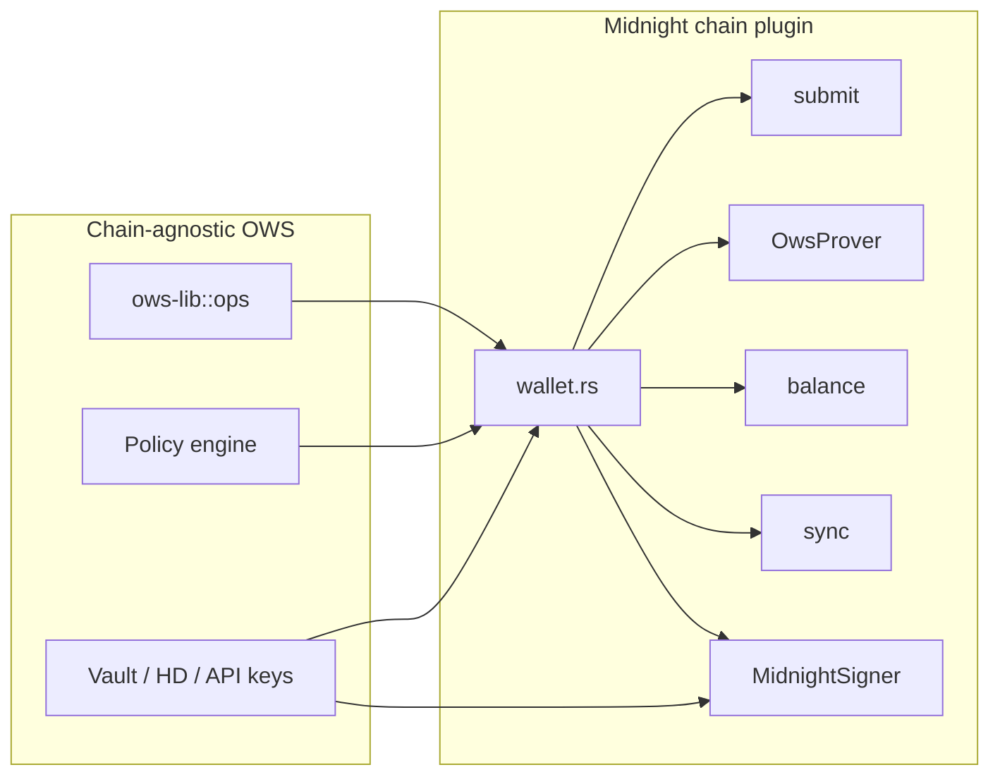

# Midnight Chain Plugin Interface

> How Midnight is integrated into OWS: the contract between chain-agnostic wallet core and
> chain-specific signing, sync, and broadcast logic.

## Overview

Midnight is built on the official **`midnight-ledger` Rust crates** (not WASM bindings). Transaction
and message shapes follow the **[DApp Connector API](https://github.com/midnightntwrk/midnight-dapp-connector-api)`,
the same boundary used for CLI, library, and agent-driven flows.

Most OWS chains use a thin **`ChainSigner`** plugin (address, message, opaque tx bytes). Midnight
adds a second layer in `ows-lib::chains::midnight`: **`MidnightSigner`** handles unshielded Schnorr;
**`wallet.rs`** orchestrates indexer sync, balancing, proving, sealing, connector JSON, and submit.

Built-in **proving** (`OwsProver`), **persisted indexer sync**, and **three credentials** per
account (unshielded, shielded, DUST) are described in [architecture.md](./architecture.md).
Addressing and derivation roles are in [addressing.md](./addressing.md).

## Operations

| OWS operation | Behavior |
|---------------|----------|
| Derive addresses | Unshielded via `ChainSigner`; shielded + DUST via separate HD roles ([addressing.md](./addressing.md)) |
| `sign` (tx) | Hex wire or DApp Connector / MIP-0006 JSON → sync → balance → prove → seal → sign |
| `signAndSend` | Same pipeline, then `author_submitExtrinsic` on `midnight:*:node` |
| `signMessage` | Unshielded BIP-340 Schnorr (connector `signData` shape) |
| Fund balance | Indexer replay for unshielded, shielded, and DUST balances |
| Policy pre-check | `transaction.raw_hex` when decodable; often empty for `makeIntent` until after decrypt ([03 — Policy Engine](../03-policy-engine.md)) |

### Transaction inputs (`--tx`)

| Input | Result |
|-------|--------|
| Sealed hex `midnight:transaction[v9](…pedersen-schnorr…)` | Sign owned UTXOs/DUST → re-serialize |
| Unsealed hex `…proof-preimage,embedded-fr…` | Sync → balance → prove → seal → sign |
| `makeTransfer` / `makeIntent` JSON | Build unsealed tx, then pipeline above |
| `balanceSealedTransaction` JSON | Taker completes maker swap offer |
| MIP-0006 JSON or `zswapoffer…` bech32 | Validated offer → balance → sign → submit |

Swap workflows and `ows sign export-mip6-offer` are in [swap-intent.md](./swap-intent.md).

## Networks and configuration

| Network | CAIP-2 |
|---------|--------|
| Mainnet | `midnight:mainnet` |
| Preview | `midnight:preview` |
| Preprod | `midnight:preprod` |

Indexer GraphQL and node RPC URLs are set in `~/.ows/config.json` (`rpc["midnight:<network>"]`,
`rpc["midnight:<network>:node"]`). The `midnight` namespace is **provisional** until registered in
the [Chain Agnostic Namespaces registry](https://github.com/ChainAgnostic/namespaces). See
[07-supported-chains.md](../07-supported-chains.md) for aliases and sync cache layout.

Node and Python bindings use the same paths as the CLI ([02 — Signing Interface](../02-signing-interface.md#interface-definition)).

## Related documents

| Document | Contents |
|----------|----------|
| [architecture.md](./architecture.md) | Cryptography, dependencies, sync behavior |
| [addressing.md](./addressing.md) | CAIP-2/10, HRPs, HD roles |
| [swap-intent.md](./swap-intent.md) | Atomic swaps, MIP-0006 |
| [07-supported-chains.md](../07-supported-chains.md) | Registry and operator knobs |

## External references

- [Midnight DApp Connector API](https://github.com/midnightntwrk/midnight-dapp-connector-api)
- [Midnight developer docs](https://docs.midnight.network/)
- [Midnight Improvement Proposals](https://github.com/midnightntwrk/midnight-improvement-proposals)
